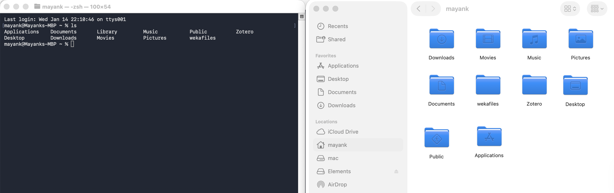

# Overview

1. Intro to cluster computing
2. Beginner-friendly crash course
3. Advanced: bash scripts (.sh files), Slurm jobs, and executing complex workflows

This repository is only meant to introduce the commands that are helpful in molecular population genomic workflows. If you want a more in-depth rundown on general cluster computing using UCR's computer cluster, please refer to  https://hpcc.ucr.edu/manuals/

# Intro to cluster computing
The goal in most population genomic analyses is to compute statistics from large datasets of single-nucleotide polymorphisms (SNPs). These computations generally require working in a computer cluster environment, which is better suited for handling large population genomic datasets. Almost every cluster environment on this planet runs on UNIX/LINUX systems, and most don't have a graphical user environment. In other words, you won't be able to access your files and folders (aka directories in the programming world) as you do in a Windows File Explorer or a Mac Finder. 
In UNIX/LINUX systems, the primary tool of choice to access your files and folders is the terminal (in Mac) and the command prompt (in Windows). The next section describes basic terminal commands that come in handy to navigate through a computer cluster. 

# Beginner-friendly crash course 
This crash course is written for Mac users and contains instructions using the native terminal app.
Every time a user opens a new terminal window, the default folder that the terminal logs into is the home directory on your Mac. *Figure 1* shows my new terminal window where I executed a command `ls`, which outputs a list of folders and files in the current directory (aka the home directory)

*Figure 1: Showing a list of folders in the home directory. Notice that the finder window and `ls` output in the terminal window show the same list of folders*

1. **Logging into the UCR computer cluster**
Advanced users might be interested in setting `ssh` keys, but for beginners, there is a simpler login procedure that does not require writing any complex code. To give a beginner user more context, `ssh` is a standard protocol used to connect to a remote computer cluster. In our case, we will connect to UCR's high-performance computer cluster (aka hpcc). 
To login into UCR's hpcc via `ssh` type in the following command

```bash
ssh <username>@cluster.hpcc.ucr.edu
```

The user will then be prompted for a password and Duo two-factor authentication, similar to other UCR associated accounts.

![[images/figure2.png]]

2. **Home directory in UCR hpcc (aka `/rhome/<username>`)**
Similar to [Figure 1](images/figure1.png), which terminal logs into when you have just opened it, `ssh` login will log into the home directory in UCR's hpcc. 

==Use the `ls` command in hpcc home directory.== 

```bash
# Pilot CURE assignment 1
#ls' command in the UCR hpcc home directory 
# Question 1: What folders were listed in UCR hpcc home directory?
# Here is the link to the UCR hpcc manual, which describes our data storage policy (https://hpcc.ucr.edu/manuals/hpc_cluster/storage/). Our lab pays for 10 tb of Big Data storage in addition to 20 GB home directory space.
# Question 2: Out of the directories listed in your home directory in UCR hpcc, which directory/directories can be utilised to store a data file that is 50 GB in size? 
   
```


# Advanced:
## Downloading and syncing files between the server and the local machine
## rsync
```bash
rsync -avz \
  mkash006@cluster.hpcc.ucr.edu:/rhome/mkash006/bigdata/Chapter_1_analysis/snpcall_het/results/filtered_vcfs\
  /Users/mayank/Desktop/hpcccluster_rsync/filtered_vcfs_gup


# Running this command syncs the local directory with the cluster directory. local file paths and SSH file paths can be changed depending on what folders are going to be synced
```
## wget
Following Slurm job was set up to download raw sequencing reads from bioshare server

```bash
#!/bin/bash

#SBATCH --job-name=wget_donwload
#SBATCH --output=wget.logs
#SBATCH --error=wget.err
#SBATCH --partition=epyc
#SBATCH --nodes=1
#SBATCH --ntasks=1
#SBATCH --cpus-per-task=10
#SBATCH --mem=20G
#SBATCH --time=96:00:00
#SBATCH --mail-type=END,FAIL
#SBATCH --mail-user=mkash006@ucr.edu

wget -r --level=10 -nH -nc --cut-dirs=3 --no-parent --reject "wget_index.html" --no-check-certificate --header "Cookie: sessionid=ijc8rwlzq3msdaazp1hfsimo1z3uvsfv;" https://bioshare.bioinformatics.ucdavis.edu/bioshare/wget/7cgjny1nx14k803/wget_index.html

```
